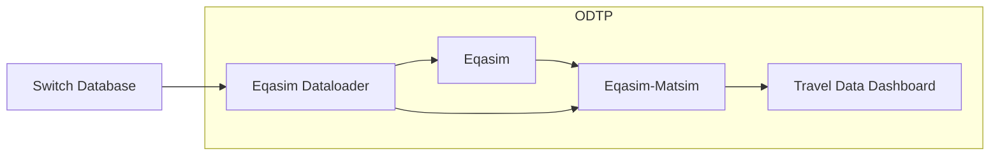

# dt-corsica-mobility

This is a prototype on how to share a DT for Corsica using ODTP


## Tutorial to run the pipeline in ODTP

> **Important:** To run this dataset, you need to have the initial dataset switch link. Please ensure you have access to the original dataset before starting. Open an issue to request it.

1. Clone this repository
2. Edit `parameters/001.parameters` with the switch link that contains the original dataset. 
3. Edit `secrets/001.secrets` with the switch password in order to download the initial dataset. 
4. Edit `dt-corsica-mobility.sh` with the ODTP user email, Execution and DT names. 
5. Run the bash script: `sh dt-corsica-mobility.sh`

## How to run the pipeline with Docker Compose

Docker compose makes use of already prebuilt images available in dockerhub for the latest versions of each component. A docker compose can run one single pipeline execution of this digital twin when executed correctly. 

1. Start the pipeline. A folder called `execution` will be generated with all the intermidiate files. At the end of the pipeline the dashboard will be accessible in `localhost:8502`

    ```bash
    docker-compose up
    ```
2. Stop and remove the containers:

    ```bash
    docker-compose down
    ```
3. Delete the execution folder:

    ```bash
    rm -rf execution
    ```

## Changelog

- v2.0.0
    - Regorganization of folder structure
    - Addition of delete command
    - Addition of docker-compose for isolated run
    - Added link with password to initial dataset
    - Updated component to last version
    - Addition of `odtp.yml` for use of execution as components. This is still under development.  

- v1.0.0
    - Basic implementation for testing purposes