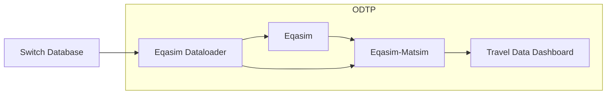

# dt-corsica-mobility

This is a prototype on how to share a DT. 

## Tutorial

1. Clone this repository
2. Copy `cp dt-corsica/001.parameters.dist dt-corsica/001.parameters` and add the switch link that contains the original dataset on `dt-corsica/001.parameters`.
3. Copy `cp dt-corsica/004.secrets.dist dt-corsica/004.secrets` and add the github secrets on `dt-corsica/004.secrets`in order to retrieve the travel data dashboard private repository and add the . 
4. Edit `dt-corsica-mobility.sh` with the ODTP user email 
5. Make the project directory: `mkdir dt-corsica/execution`
6. Make the bash script executeable: `chmod +x dt-corsica-mobility.sh`
6. Run the bash script: `./dt-corsica-mobility.sh`
